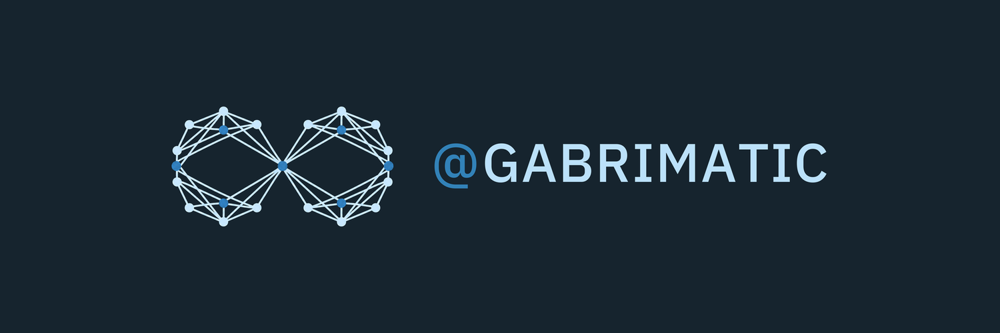

  

# Hi, I'm Soroush

Mobile engineer and tech lead. I ship across Android, iOS, web, and desktop. Native Android and iOS came first; Flutter has been part of my production work since 2019.

At **[Affinidi](https://www.affinidi.com/)**, I work on the Internet of Trust: verifiable credentials, DIDComm, an agentic AI trust gateway, and Dart SDKs. At **[City-Flock](https://www.city-flock.de/en)**, I build a community safety app that matches people travelling in the same direction to make everyday journeys safer.

Most evenings, I build local LLM tools: MLX experiments, on-device voice, terminal tools, and small systems that keep inference close to the machine.

## What I Build

### On-device AI

- **[local-whisper](https://github.com/gabrimatic/local-whisper)** - on-device voice transcription with grammar correction and TTS for private voice workflows.
- **[eyra](https://github.com/gabrimatic/eyra)** - real-time screen analysis with voice interaction. It routes between models when the task changes.
- **[kokoro-mlx](https://github.com/gabrimatic/kokoro-mlx)** - Kokoro-82M text-to-speech running on-device via MLX.
- **[qwen3-asr-mlx](https://github.com/gabrimatic/qwen3-asr-mlx)** - Qwen3-ASR speech-to-text running on-device via MLX.
- **[threadstone](https://github.com/gabrimatic/threadstone)** - offline terminal chat for local LLMs. Multiple instances, no dependencies.
- **[personal_ollama_cli](https://github.com/gabrimatic/personal_ollama_cli)** - terminal sessions for local Ollama models, with context and persistence.

### Flutter & Dart

- **[restart_app](https://github.com/gabrimatic/restart_app)** - restart Flutter apps from one call across Android, iOS, Web, macOS, Linux, and Windows.
- **[passes_box](https://github.com/gabrimatic/passes_box)** - offline password manager with AES-256 and biometric auth. No network path.
- **[otp_auth](https://github.com/gabrimatic/otp_auth)** - HOTP and TOTP one-time passwords for Dart.
- **[ollama_flutter_gui](https://github.com/gabrimatic/ollama_flutter_gui)** - Flutter Web GUI for local Ollama models.
- **[graphql_fragment_builder](https://github.com/gabrimatic/graphql_fragment_builder)** - type-safe GraphQL fragment and query builder for Dart.
- **[persian_datetimepickers](https://github.com/gabrimatic/persian_datetimepickers)** - Persian and Gregorian date/time pickers.
- **[center_the_widgets](https://github.com/gabrimatic/center_the_widgets)** - keeps mobile-first layouts readable on web and large screens.
- **[flutter_chrome_extension](https://github.com/gabrimatic/flutter_chrome_extension)** - Chrome extension built with Flutter Web.
- **[more packages](https://pub.dev/publishers/gabrimatic.info/packages)**

### MCP Servers

- **[mcp-web-search-tool](https://github.com/gabrimatic/mcp-web-search-tool)** - MCP server that lets AI models search the web in real time ([demo](https://youtu.be/6jAnjJSCL30)).
- **[mcp-prose-memory](https://github.com/gabrimatic/mcp-prose-memory)** - MCP server for persistent memory backed by Markdown files.

## Now

- Building safer digital identity at **[Affinidi](https://www.affinidi.com/)** and safer everyday journeys at **[City-Flock](https://www.city-flock.de/en)**
- Building local AI tools around MLX, voice, and on-device inference
- Maintaining Flutter and Dart packages on [pub.dev](https://pub.dev/publishers/gabrimatic.info/packages)
- Keeping [gabrimatic.info](https://gabrimatic.info) as the public home for the work

## Connect

## Beyond code

- Photography, mostly when I leave the keyboard.
- Worked in bookstores for two years. Books stayed with me.
- Cinema. Film theory and storytelling.
